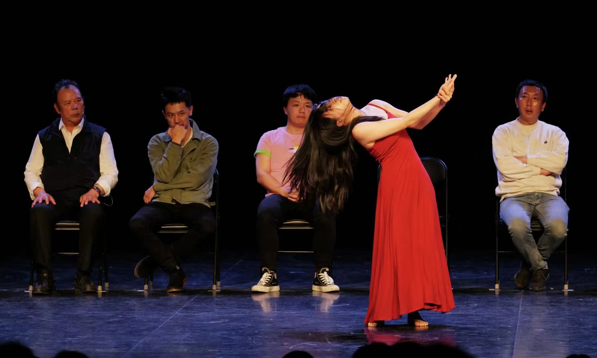
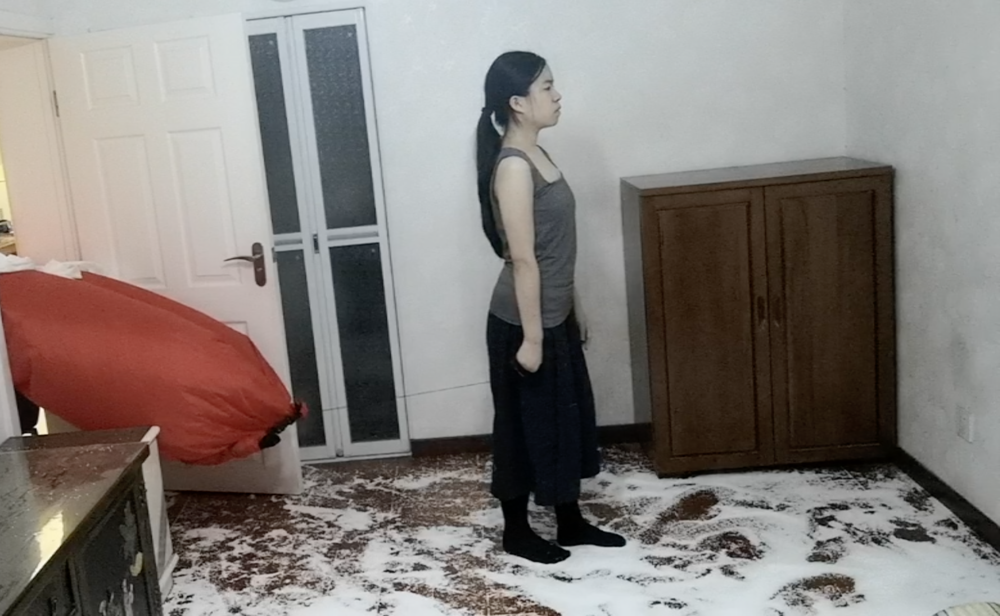

# About
Xindi Cao is a Norway-based artist originally from Beijing, China, with backgrounds in philosophy, anthropology of dance, and contemporary theatre. Her artistic practice revolves around activating the body in intercultural performance using a phenomenological approach in fieldwork. Currently, her research focuses on exploring the intersection of technology, cultural identity, and embodied experience. She works with software engineers dancing in VR, Chinese immigrant families engaging with chopsticks, and Covid-19 patients dancing in cabin hospitals. In her work, she delves into the delicate realm between art and activism, blurring the lines between theatre and real life. Compared with making art, she is more interested in everyday movements, the dance outside of the theatre and how to make a living outside of the artistic production mechanism.

# Performance
[Portfolio](https://youtu.be/MHtyB4peW4c?si=f1CHmJusCN6KyYdn)

### Looking for a River (concept, choreographer, performer)
*The flowing river is the flowing reality
The reality runs through my body*
How do people’s thinking  connect with their bodies’ senses ?
How does the change from the subject-object dichotomous epistemology to the unified phenomenological method relate to the body transition in the history of philosophy?
How can a person become unified? Is the body a channel?

### Wash (concept, director, choreographer, performer) 
*Whitening, Brainwashing, Heart Cleaning—Our World is Bright and Beautiful.*

### 知行合一2.0 Zhi Xing He Yi 2.0 (concept, choreographer, performer)
“Zhi Xing He Yi” is a philosophical idea of Wang Yangming, who was a thinker in China Ming Dynasty. I intentionally  misused it as the title of this work to show the irony —- the unity of knowledge and action (translated literally).

### 知行合一1.0 Zhi Xing He Yi 1.0 (concept, choreographer, performer)

### 大众力学 Popular Mechanics (dancer, directed by Li Jianjun) 

## Short Dance Film

14 Days as an Island (concept, choreographer, performer)
 <https://youtu.be/QGrIBp6D-Wo>
 

This is How I... (concept, choreographer, composer, performer) 
<https://youtu.be/hw6YEA80sGQ>

# Art as Method
Can we dance unconsciously 
我们谈论的是关于我们谈论的是关于未来-a dance review

# Music
未发 Wei Fa 
▶️

From Dummy to ? 
▶️https://soundcloud.com/cindy-cao-547754078/from-dummy-to

[童年断裂带 Fracture Zone of Childhood]
对不起，不曾唱同一首歌 Sorry, Never Sang the Same Song
▶️https://soundcloud.com/cindy-cao-547754078/sorry-never-sang-the-same-song

被浪踏 Stepped by the Waves
▶️https://soundcloud.com/cindy-cao-547754078/stepped-by-the-waves

化水鱼 Fish Melting in the Water
▶️https://soundcloud.com/cindy-cao-547754078/fish-melting-in-the-water

# Research
# Writings

